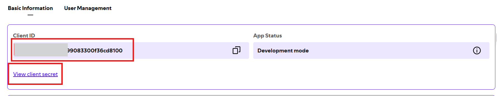
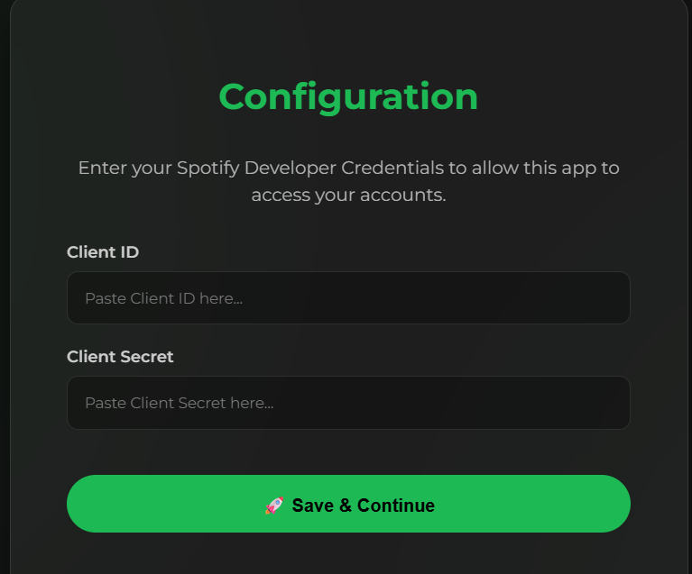
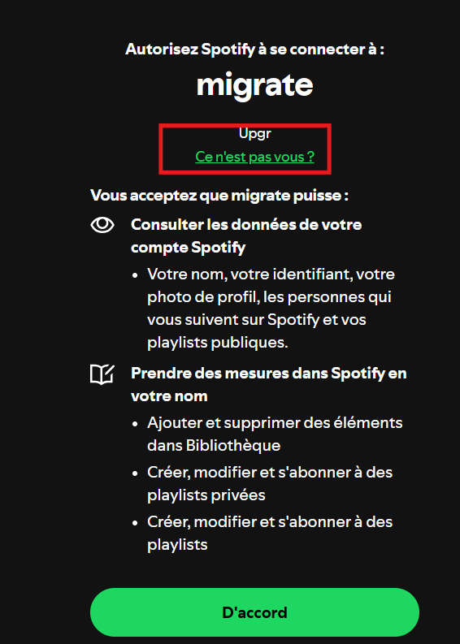
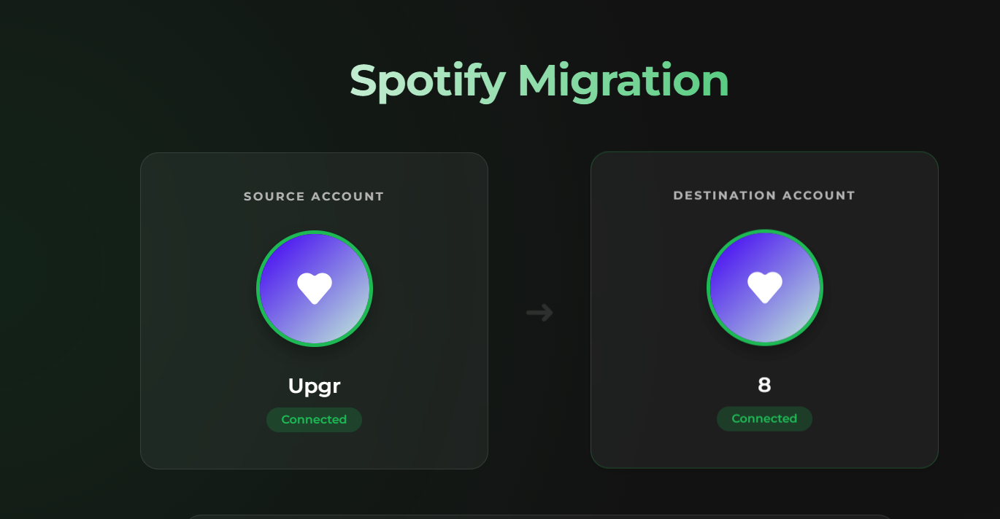
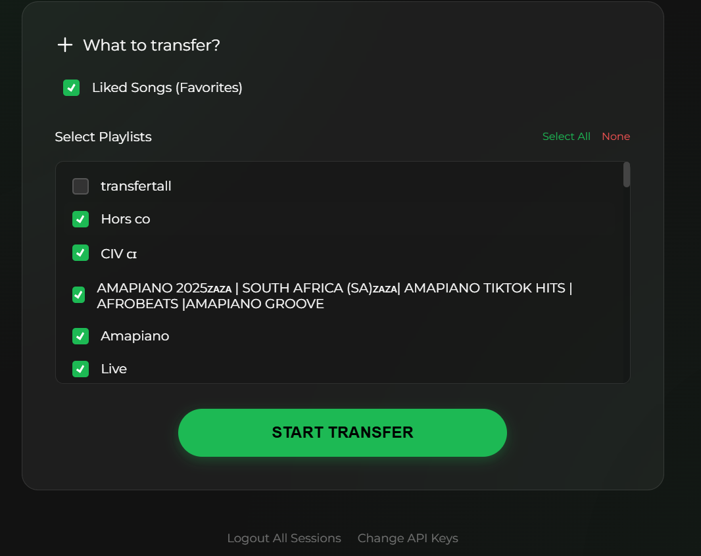
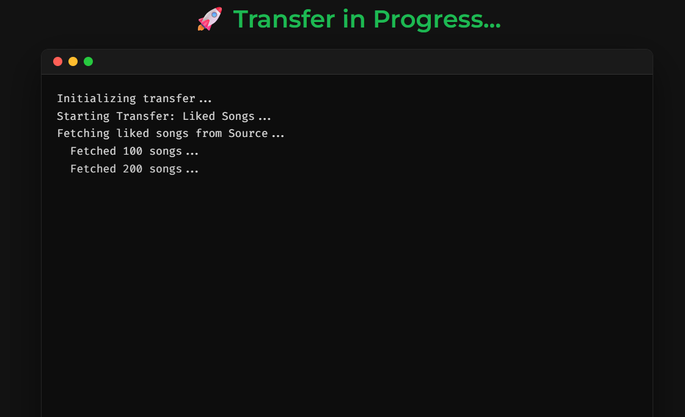
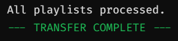

# Spotify Migration Tool

Spotify Migration Tool is a user-friendly web application designed to help you move your entire music library (Liked Songs and Playlists) from one Spotify account to another. Built with Python (Flask). Ideal for users switching accounts to cheaper regions or new profiles.

## Live Demo

[https://spotify-migration-tool.onrender.com](https://spotify-migration-tool.onrender.com)

## Features

- **Double Authentication**: Handles Source and Destination accounts simultaneously.
- **Liked Songs Transfer**: Moves all your liked tracks.
- **Playlist Transfer**: Recreates your playlists on the new account.
- **Smart Handling**:
  - Uses pagination to fetch all items (not just the first 50).
  - Batches API requests to respect rate limits.
  - Separate cache files to keep sessions distinct.

## Prerequisites

- Python 3.6+
- A Spotify Developer App (Client ID and Secret)

## Installation

1.  Clone this repository or download the files.
2.  Install the required dependencies:

    ```bash
    pip install -r requirements.txt
    ```

## Configuration

You must set the following environment variables.

1.  Go to the [Spotify Developer Dashboard](https://developer.spotify.com/dashboard/).

2.  Create an app.

    

3.  Set the **Redirect URI** to:

    - `http://127.0.0.1:5000/callback/source`
    - `http://127.0.0.1:5000/callback/dest`
      _(Or your domain if deployed)_

    

4.  Copy your **Client ID** and **Client Secret**.

    

## Usage

1.  Run the web application:

    ```bash
    python app.py
    ```

2.  Open your browser and navigate to `http://localhost:5000`.

3.  **Setup (First Time)**:

    - You will be redirected to a **Setup Page**.
    - Enter your **Client ID** and **Client Secret**.

      

    - Click Save.

4.  **Transfer**:

    - Connect your Source and Destination accounts.
    - On the Destination account, you need to click on "it's not you" for disconnect the source and connect the destination.

    

    - Now you are connected to both accounts.

    

    - Select what you want to transfer.

    

    - Start!

    

    - You will know when the transfer is finished.

    

## Notes

- The app runs locally on port 5000.
- Logs are streamed directly to the browser window.

## Notes

- Your tokens are cached in `.cache-source` and `.cache-dest`. Delete these files if you need to reset headers/login.
- Local files in playlists are skipped.
